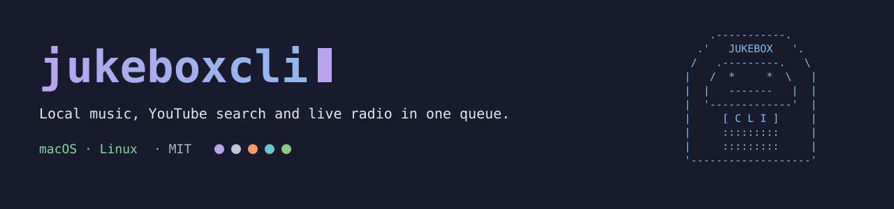
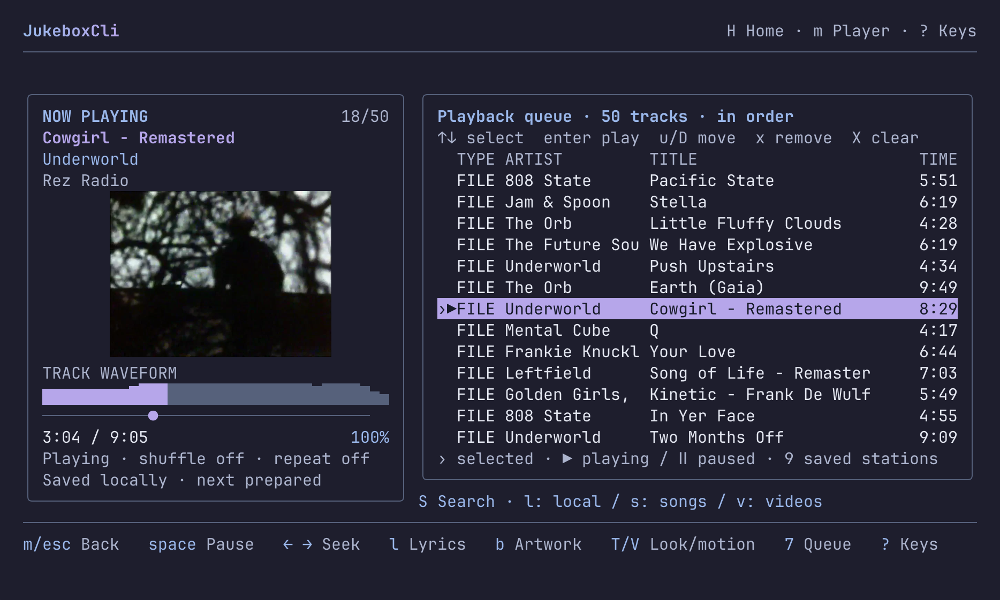
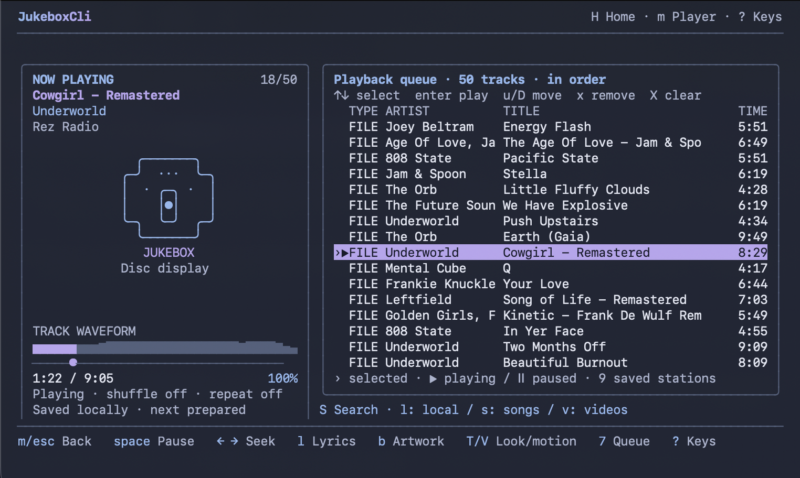
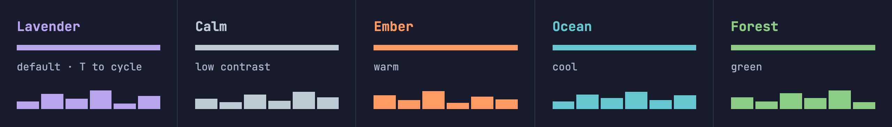

<div align="center">



**A music player that lives in the terminal.** Local files, YouTube search and live radio in one editable queue.

[](https://github.com/funstuie-bit/JukeboxCli/releases/latest)
[](https://github.com/funstuie-bit/JukeboxCli/actions/workflows/mac-install.yml)
[](https://github.com/funstuie-bit/JukeboxCli/actions/workflows/linux-install.yml)
[](LICENSE)

[Install](#get-going) · [Controls](#first-run) · [Artwork](#artwork-and-terminals) · [Visualisers](#themes-and-visualisers) · [Credits](#credits)


</div>

I started this as a boredom project and it got slightly out of hand. JukeboxCli now
plays local music, searches YouTube Music without an account, handles live radio and
keeps the lot in one editable queue. Streams stay streams unless you choose to save
them.

Playing or browsing online music does not add it to your library. Downloads only
start when you ask for one.

## Get going

**Linux (Arch):**

```sh
sudo pacman -S --needed nodejs npm mpv ffmpeg
git clone https://github.com/funstuie-bit/JukeboxCli.git
cd JukeboxCli && ./install.sh
jukeboxcli
```

**macOS (Homebrew):**

```sh
brew tap funstuie-bit/jukeboxcli https://github.com/funstuie-bit/JukeboxCli.git
brew install funstuie-bit/jukeboxcli/jukeboxcli
jukeboxcli
```

Homebrew installs the required tools. Source installs need Node.js 22+, npm, mpv and ffmpeg.
On Linux, a system-owned npm prefix makes the installer use `$HOME/.local`;
ensure `$HOME/.local/bin` is on your `PATH`. Don't run the app installer with sudo.

Run `jukeboxcli --doctor` to check an install
without opening the player. Other distributions, PATH notes and troubleshooting are
in the [Linux install guide](docs/linux-install.md) and the
[macOS install guide](docs/mac-controls-and-install.md); the full detail is
[below](#install-in-full).

## What it does

- Plays local files, YouTube results, direct audio links and live radio.
- Keeps local, online and live tracks in one persistent queue.
- Searches inside Now Playing: `S`, then `l:` for local music, `s:` for songs or `v:` for videos.
- Searches songs, videos, albums, artists and playlists without a YouTube login.
- Shows sharp cover artwork in Ghostty, Kitty-compatible, iTerm2 and Sixel terminals, with text and block fallbacks elsewhere.
- Runs a live visualiser by default on Mac and Linux, with six styles you can cycle using `v`.
- Offers optional Linux fullscreen effects powered by projectM/MilkDrop presets.
- Supports local LRC files and optional online lyrics.
- Downloads from YouTube and SoundCloud, and imports music from supported Spotify links.
- Handles shuffle, repeat, queue editing and listening history. mpv supplies playback and macOS media-key support.

[What's different?](docs/whats-different.md) covers what I added to soundcli, the
ideas borrowed from ytkew and Mousiki, and where the radio, search and lyrics
features ended up.

## First run

JukeboxCli opens on Home. Search online, browse internet radio or open your local
music. You don't need a library or a sign-in to get started.

| Key | Action |
| --- | --- |
| `8`, then `/` | Search online |
| `o` | Play a YouTube or direct audio URL |
| `9` | Open radio and saved stations |
| `9`, then `M` | Browse quick radio genre channels |
| `9`, then `B`, `g` or `c` | Browse popular radio, genres or countries |
| `9`, then `/` | Search for a station by name |
| `1` | Open the local library |
| `m` or `6` | Open Now Playing |
| `7` | Open the queue |
| `space` | Play or pause; reconnect live radio |
| `?` | Show the full key guide |

Use `A` to append a selected track and `P` to play it next. In the queue, `u` and
`D` move an entry, `x` removes it, and `X` clears the queue after confirmation.


<details>
<summary>Home screen</summary>


</details>

## Artwork and terminals

Ghostty, Kitty-compatible terminals, iTerm2 and Sixel terminals can display
high-resolution cover artwork. Foot selects Sixel automatically, and incremental
screen updates keep the image in place while the player and visualiser move.



Apple's built-in Terminal gets a text drawing instead. It's basic, but the
pixelated covers weren't doing much for it. Other terminals without image support
still use block artwork.



Press `b` in Now Playing to hide the artwork. `JUKEBOXCLI_ART=blocks jukeboxcli`
forces the fallback renderer, which also brings back pixel artwork in Apple's
Terminal if you prefer it. `JUKEBOXCLI_ART=simple jukeboxcli` uses the text drawing
in any terminal.

## Themes and visualisers

Press `T` in Now Playing to cycle Lavender, Calm, Ember, Ocean and Forest.



The live audio visualiser runs by default on **Mac and Linux**. Lowercase `v`
cycles Classic Peak, Smooth, Bass Mirror, Outline, Bricks and Mosaic.
Uppercase `V` controls decorative motion, not the audio visualiser.

**Fullscreen MilkDrop effects are Linux-only.** The optional projectM companion
opens a separate graphics window while playback and the terminal visualiser
continue. Press uppercase `F` in Now Playing after installing the optional
frontend. It captures system output, so other apps can affect it too.
See the [Linux setup below](#install-in-full) and [visualiser notes](docs/visualiser-prototype.md).
This mode is not integrated on macOS yet.

## Radio

Radio searches the community Radio Browser catalogue. In section **9**, press **M**
for quick channels, **B** for popular stations, **g** for genres/tags, **c** for
countries or **/** to search by station name. Quick choices cover Lo-fi, Synthwave,
Ambient, Chillout, Jazz, Classical, House, Drum & Bass, Reggae and Rock. They are
ordinary Radio Browser tag searches, not bundled or copied station feeds. Directory
results stay temporary until you explicitly save one with **f**.

## Status and limits

**Current release: [1.1.1](https://github.com/funstuie-bit/JukeboxCli/releases/tag/v1.1.1).**
This fixes background mpv playback surviving a crash or force-close on Mac/Linux.
Restart after updating. Older orphaned players are not automatically stopped.
[Changelog](CHANGELOG.md).

Automated install checks run on Apple Silicon and x64 Linux. Intel Macs and other
Linux architectures aren't part of those checks.

A few limits are worth knowing:

- YouTube Music discovery uses an unofficial signed-out API and may need maintenance when YouTube changes it.
- There is no YouTube Music account login, liked-music sync or personalised radio.
- Radio availability, artwork and metadata depend on the station. DRM and general Radio Garden browsing are not supported.
- Online lyrics are optional and coverage varies. Local `.lrc` files work offline.
- macOS system media controls are supplied by mpv, so the system may label the player as mpv.

Saved radio or audio URLs can include private query tokens. Treat your JukeboxCli
profile files as private.

<h2 id="install-in-full">Install in full</h2>

<details>
<summary><strong>Linux · other distributions, PATH and Sixel</strong></summary>

<br>

JukeboxCli supports 64-bit Linux and needs Node.js 22 or newer, mpv and ffmpeg.

If npm's configured global directory is system-owned, as it normally is with Arch's
npm package, the installer automatically uses `$HOME/.local`. Ensure
`$HOME/.local/bin` is on your `PATH`; the installer prints the installed path.

For other distributions, install Node.js 22+, npm, mpv and ffmpeg, then use the
same source installation commands. See the
[Linux install guide](docs/linux-install.md) for package-manager examples, profile
paths and troubleshooting.

Foot uses sharp Sixel artwork automatically. The live visualiser is on by default
on Linux; press `v` in Now Playing to cycle Classic Peak, Smooth, Bass Mirror,
Outline, Bricks and Mosaic. Use `JUKEBOXCLI_VISUALIZER=0 jukeboxcli` if you prefer
the static waveform.

</details>

<details>
<summary><strong>Linux · fullscreen MilkDrop-style effects</strong></summary>

<br>

For a separate, old-school Winamp/MilkDrop-style fullscreen window, install the
optional projectM frontend:

```sh
sudo pacman -S --needed projectm-pulseaudio
```

Then press uppercase `F` in Now Playing, or choose **Settings → Player appearance →
Fullscreen effects**. JukeboxCli selects the active PipeWire/PulseAudio output
monitor, opens a shuffled preset fullscreen and leaves the terminal player and
compact visualiser running. Close the graphics window with `Alt+F4` to return.
Because this first implementation listens to the active system output, audio from
other applications can also affect the animation.

</details>

<details>
<summary><strong>macOS · the formula, installing from a clone</strong></summary>

<br>

The Homebrew tap is the project's own formula, not part of Homebrew's main
collection. It builds from source and installs Node, mpv, ffmpeg and yt-dlp. It
uses a specific tagged release, so it won't pick up every commit on GitHub. The
[install guide](docs/mac-controls-and-install.md) lists the version it installs.

To install from a clone instead:

```sh
brew install node
git clone https://github.com/funstuie-bit/JukeboxCli.git
cd JukeboxCli
./install.sh
jukeboxcli
```

You need Node 22+ and Homebrew before running the macOS source installer. It
installs mpv if needed and builds a command you can run from anywhere (moving the
cloned folder won't break it). The app can download its own yt-dlp and ffmpeg
copies on first launch.

</details>

<details>
<summary><strong>Updating</strong></summary>

<br>

Homebrew install (macOS):

```sh
brew update
brew upgrade jukeboxcli
```

Source install (macOS or Linux):

```sh
cd JukeboxCli
./update.sh
```

`update.sh` refuses to overwrite a checkout with local changes.

</details>

<details>
<summary><strong>Downloads and cookies</strong></summary>

<br>

Choose the audio format, quality, output folder, delays and retry count. You can
use cookies from your browser or a Netscape-format `cookies.txt` file.

```sh
jukeboxcli --format mp3 --cookies-from-browser chrome:Default "https://..."
jukeboxcli --output-dir ~/Music/MyLibrary --quality 5 @somehandle
```

Settings → Download pacing controls the pause between downloads (1–3 seconds by
default) and retry count. These delays aren't a transfer-speed limit. Cookies help
with access to a source; they don't guarantee faster downloads.

Command-line options apply only to the current launch. Change a preference in
Settings to save it for future launches. Playing and downloading during that launch
use the temporary options; changing an unrelated setting won't save them.

On Linux, Chromium-family cookie selections use GNOME Keyring when its Secret
Service is present, so yt-dlp can decrypt the signed-in browser session instead of
silently falling back to anonymous requests.

Run `jukeboxcli --help` for the full list. Spotify support imports music from
supported links; it is not Spotify streaming.

</details>

<details>
<summary><strong>yt-dlp release channels</strong></summary>

<br>

Settings → yt-dlp updates lets you choose **App-managed nightly**, **App-managed
stable**, or **System / package manager**, including on Homebrew installs. Startup
checks allow up to 60 seconds for a cold yt-dlp launch and report timeout or
process errors if the downloaded copy cannot run.

Homebrew's copy remains the default until you opt in. Selecting an app-managed
channel downloads and checks a separate copy in JukeboxCli's cache; restart to
apply it. Selecting System switches back on the next launch without deleting the
cached copy. Failed updates leave the saved choice unchanged.

This choice affects only yt-dlp: Homebrew still manages mpv and ffmpeg. Automatic
app-managed updates also stage for the next launch, so running downloads and stream
lookups aren't interrupted. `jukeboxcli --doctor` reports the selected provider,
installed app version, requested channel and any pending update, plus system tools
on PATH. See the
[Homebrew and Mac acceptance notes](docs/mac-controls-and-install.md).

</details>

## Development

```sh
npm ci
JUKEBOXCLI_HOME="$HOME/JukeboxCli-demo" npm run dev
npm test
npm run typecheck
npm run build
```

The codebase is TypeScript, React and Ink. mpv handles playback; yt-dlp and ffmpeg
handle online media and conversion.

The live visualiser is enabled by default on Mac and Linux. Press lowercase `v` in
Now Playing to cycle styles; uppercase `V` controls decorative motion instead. See
the [visualiser notes](docs/visualiser-prototype.md) for how it works and its
limits.

Want to change something? Read [CONTRIBUTING.md](CONTRIBUTING.md) before opening a
pull request.

**More detail:** [Feature status](FEATURES.md) &middot;
[Home, profiles and artwork](docs/first-run-and-home.md) &middot;
[Online listening and radio](docs/listening-online.md) &middot;
[Lyrics](docs/lyrics.md) &middot;
[Install and macOS controls](docs/mac-controls-and-install.md) &middot;
[Linux installation](docs/linux-install.md) &middot;
[Architecture](docs/architecture.md) &middot;
[Roadmap](docs/roadmap.md) &middot;
[Changelog](CHANGELOG.md)

## Credits

JukeboxCli began as a fork of [baairon/soundcli](https://github.com/baairon/soundcli).
Its library, playback and download foundations are still here, and the original MIT
notice is retained.

[dtDhruv/ytkew](https://github.com/dtDhruv/ytkew) and
[itzender5820/mousiki](https://github.com/itzender5820/mousiki) influenced the
artwork-led player and queue presentation.
[bjarneo/cliamp](https://github.com/bjarneo/cliamp) inspired the classic peak meter,
the wider family of visualiser styles and the idea of searching the community Radio
Browser directory. Those features and the terminal drawings were implemented for
JukeboxCli's own TypeScript/Ink/mpv stack; no source code or assets were copied from
those projects.

[projectM](https://github.com/projectM-visualizer/projectm) supplies the optional
Linux fullscreen renderer and MilkDrop-compatible effects. It runs separately
and retains its own licence. [Radio Browser](https://www.radio-browser.info/)
supplies the community station directory.

Released under the [MIT License](LICENSE).
