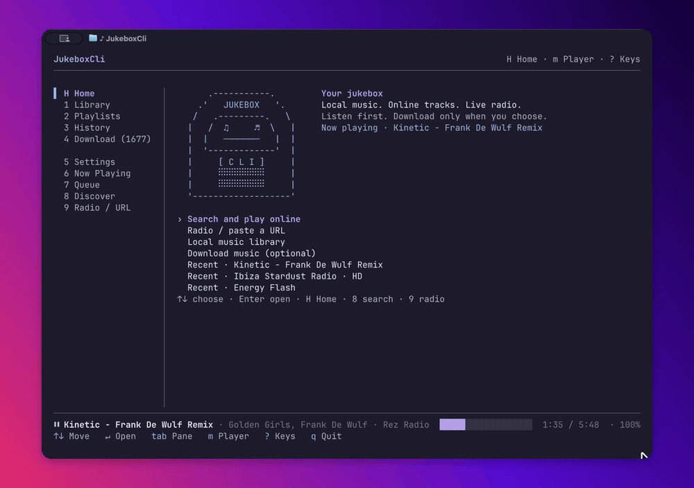
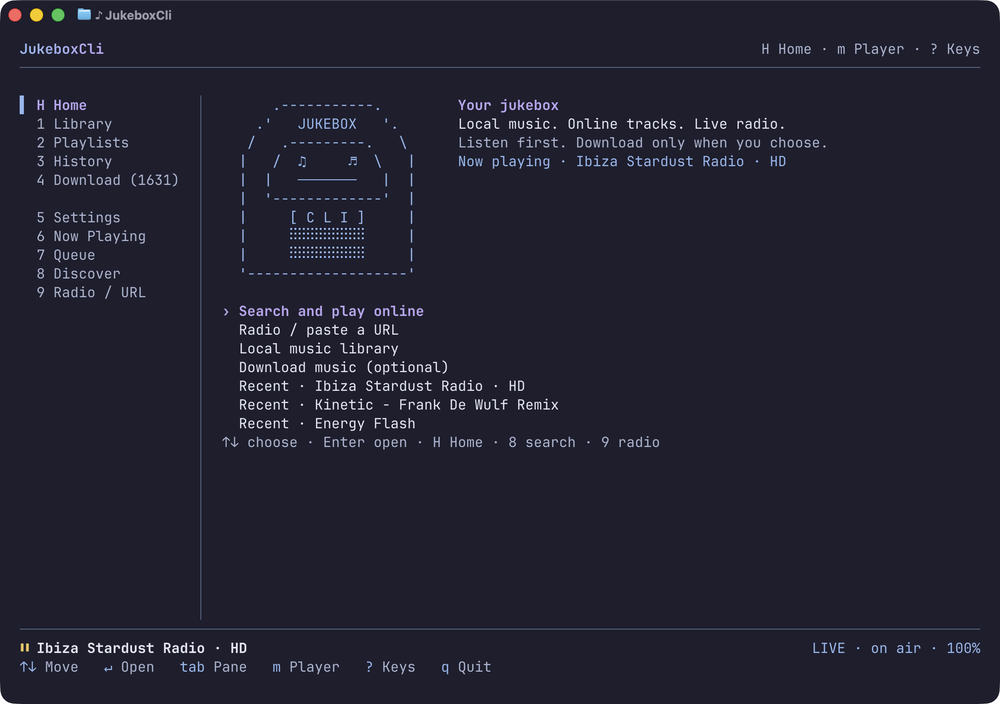
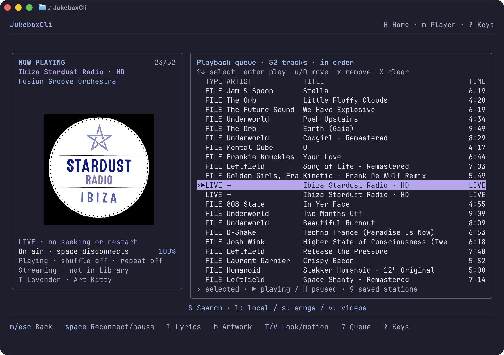

# JukeboxCli

A Mac-first music player that lives in the terminal.

I started this as a boredom project and it got slightly out of hand. JukeboxCli now plays local music, searches YouTube Music without an account, handles live radio and keeps the lot in one editable queue. Streams stay streams unless you choose to save them.

[](https://github.com/funstuie-bit/JukeboxCli/actions/workflows/mac-install.yml)



## What it does

- Plays local files, YouTube results, direct audio links and live radio.
- Keeps local, online and live tracks in one persistent queue.
- Searches songs, videos, albums, artists and playlists without a YouTube login.
- Shows inline artwork in Ghostty, Kitty-compatible terminals and iTerm2, with a text fallback elsewhere.
- Supports local LRC files and optional online lyrics.
- Downloads from YouTube and SoundCloud, and imports music from supported Spotify links.
- Handles shuffle, repeat, queue editing, listening history and macOS media keys through mpv.

Playing or browsing online music does not add it to your library. Downloads only start when you ask for one.

## Install

JukeboxCli currently supports macOS and needs Node.js 22 or newer.

The easiest install is the project’s Homebrew formula:

```sh
brew tap funstuie-bit/jukeboxcli https://github.com/funstuie-bit/JukeboxCli.git
brew install funstuie-bit/jukeboxcli/jukeboxcli
jukeboxcli
```

This is a third-party, source-built formula. It installs Node, mpv, ffmpeg and yt-dlp through Homebrew. It uses a pinned development snapshot, not the latest checkout; see the [install guide](docs/mac-controls-and-install.md).

To install from a clone instead:

```sh
brew install node
git clone https://github.com/funstuie-bit/JukeboxCli.git
cd JukeboxCli
./install.sh
jukeboxcli
```

The source installer installs missing mpv through Homebrew, then builds an independent global command rather than linking back to the checkout. Node 22+ and Homebrew must already be available. On first launch, the normal source install can manage its own yt-dlp and ffmpeg copies.

Check an installation without opening the player:

```sh
jukeboxcli --doctor
```

### Updating

Homebrew install:

```sh
brew update
brew upgrade jukeboxcli
```

Source install:

```sh
cd JukeboxCli
./update.sh
```

`update.sh` refuses to overwrite a checkout with local changes.

## First run

JukeboxCli opens on Home. You can start with public online search or radio; a local library is optional.

| Key | Action |
| --- | --- |
| `8`, then `/` | Search online |
| `o` | Play a YouTube or direct audio URL |
| `9` | Open radio and saved stations |
| `1` | Open the local library |
| `m` or `6` | Open Now Playing |
| `7` | Open the queue |
| `space` | Play or pause; reconnect live radio |
| `?` | Show the full key guide |

Use `A` to append a selected track and `P` to play it next. In the queue, `u` and `D` move an entry, `x` removes it, and `X` clears the queue after confirmation.





## Artwork and terminals

Ghostty and Kitty-compatible terminals can display real PNG artwork. iTerm2 inline images are supported too. Other terminals fall back to proportional half-block art, so the player still works without a graphics protocol.

Press `b` in Now Playing to hide the artwork. You can force the fallback renderer with:

```sh
JUKEBOXCLI_ART=blocks jukeboxcli
```

## Downloads and cookies

The download side supports audio format and quality controls, output folders, pacing, retries, browser cookies and Netscape-format `cookies.txt` files.

```sh
jukeboxcli --format mp3 --cookies-from-browser chrome:Default "https://..."
jukeboxcli --output-dir ~/Music/MyLibrary --quality 5 @somehandle
```

Run `jukeboxcli --help` for the full list. Spotify support imports music from supported links; it is not Spotify streaming.

## Current status

The current build is `0.1.0-dev.14`. I use it, but it is still an early macOS project rather than a finished cross-platform release. Development and automated install checks focus on Apple Silicon; Intel Macs are not currently a CI target.

A few limits are worth knowing:

- YouTube Music discovery uses an unofficial signed-out API and may need maintenance when YouTube changes it.
- There is no YouTube Music account login, liked-music sync or personalised radio.
- Radio availability, artwork and metadata depend on the station. DRM and general Radio Garden browsing are not supported.
- Online lyrics are optional and coverage varies. Local `.lrc` files work offline.
- macOS system media controls are supplied by mpv, so the system may label the player as mpv.

Saved radio or audio URLs can include private query tokens. Treat your JukeboxCli profile files as private.

## Development

```sh
npm ci
JUKEBOXCLI_HOME="$HOME/JukeboxCli-demo" npm run dev
npm test
npm run typecheck
npm run build
```

The codebase is TypeScript, React and Ink. mpv handles playback; yt-dlp and ffmpeg handle online media and conversion.

More detail:

- [Feature status](FEATURES.md)
- [Home, profiles and artwork](docs/first-run-and-home.md)
- [Online listening and radio](docs/listening-online.md)
- [Lyrics](docs/lyrics.md)
- [Install and macOS controls](docs/mac-controls-and-install.md)
- [Architecture](docs/architecture.md)
- [Roadmap](docs/roadmap.md)
- [Changelog](CHANGELOG.md)

Contributions are welcome; read [CONTRIBUTING.md](CONTRIBUTING.md) before opening a pull request.

## Credits

JukeboxCli began as a fork of [baairon/soundcli](https://github.com/baairon/soundcli). Its library, playback and download foundations are still here, and the original MIT notice is retained.

[dtDhruv/ytkew](https://github.com/dtDhruv/ytkew) and [itzender5820/mousiki](https://github.com/itzender5820/mousiki) influenced the artwork-led player and queue presentation. The player features inspired by those two projects and the terminal drawings were implemented here; no source code or assets were copied from either project.

Released under the [MIT License](LICENSE).
